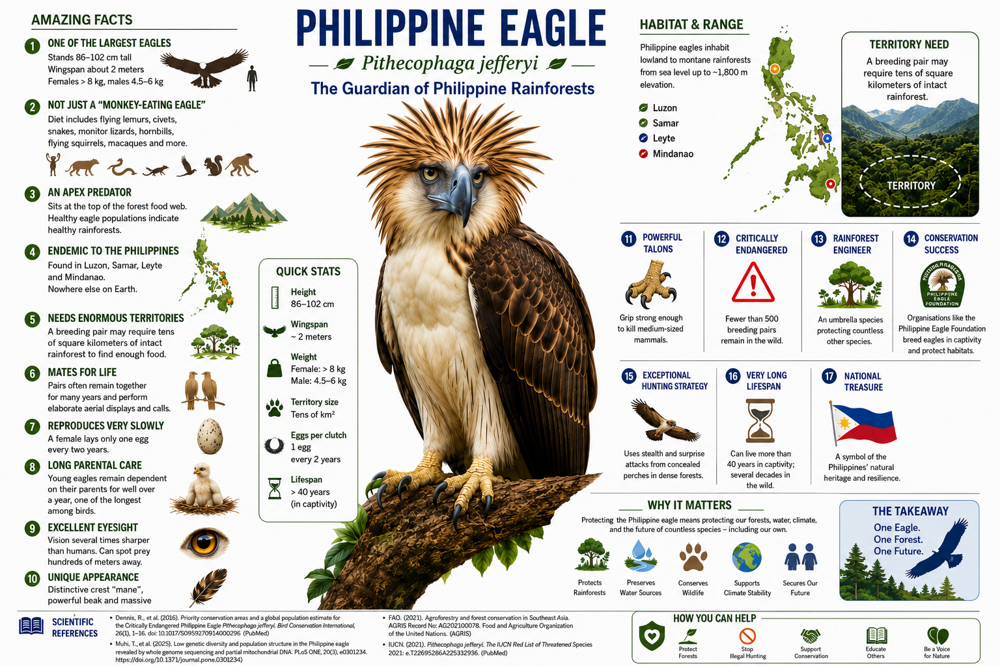

# Philippine Eagle Conservation Analytics

[](https://www.python.org/)
[](notebooks/philippine_eagle_conservation_analytics.ipynb)
[](LICENSE)
[](data/README.md)

**An integrated, literature-benchmarked conservation analytics framework for the Philippine eagle (*Pithecophaga jefferyi*), combining synthetic ecological, demographic, genomic, habitat, and population-viability datasets with reproducible statistical modelling and publication-quality visualisation.**

<p align="center">
  
</p>

## Project overview

The Philippine eagle is a critically endangered apex predator whose persistence depends on extensive, connected rainforest, successful reproduction, low adult mortality, and retention of genetic diversity. This repository converts published quantitative benchmarks into a transparent computational framework for exploring how these interacting processes may influence conservation outcomes.

The workflow does **not** reproduce confidential field records. It generates fully synthetic territories, breeding histories, demographic trajectories, and genomic summaries calibrated to peer-reviewed numerical ranges. It is intended for research-method development, teaching, scenario testing, and reproducible conservation planning.

## Main analyses

The executed notebook provides:

1. A structured registry of peer-reviewed population, habitat, movement, breeding, forest-loss, and genomic benchmarks.
2. A synthetic allocation of 392 breeding territories across Mindanao, Luzon, Samar, and Leyte.
3. Home-range, core-area, fragmentation, protection-gap, and threat-index analyses.
4. Simulated biennial breeding histories and an interpretable logistic model of fledging success.
5. Cross-validation, receiver-operating-characteristic analysis, probability calibration, and coefficient interpretation.
6. Area-of-habitat projections under alternative forest-protection scenarios.
7. Forty-year stochastic population viability analysis under contrasting conservation conditions.
8. Synthetic nuclear and mitochondrial diversity analyses, including pairing optimisation.
9. Principal-component and cluster analysis of conservation archetypes.
10. Budget-constrained intervention prioritisation based on simulated ecological benefit and cost.

## Key literature benchmarks

The simulation registry includes, among others:

- 392 estimated breeding pairs, 28,624 km² of modelled area of habitat, and approximately 32% protected coverage (Sutton et al., 2023), DOI: [10.1111/acv.12854](https://doi.org/10.1111/acv.12854).
- Median 95% home range of 68 km², median 50% core range of 13 km², and substantial space-time use outside core areas (Sutton et al., 2024), DOI: [10.1111/ibi.13233](https://doi.org/10.1111/ibi.13233).
- Mean nearest-neighbour spacing benchmark of 12.74 km (Bueser et al., 2003), DOI: [10.1046/j.1474-919X.2003.00131.x](https://doi.org/10.1046/j.1474-919X.2003.00131.x).
- Incubation duration and parental time-budget observations (Ibañez et al., 2003), DOI: [10.1676/01-054](https://doi.org/10.1676/01-054).
- Mitochondrial nucleotide-diversity and haplotype benchmarks (Bacus et al., 2025), DOI: [10.1002/ece3.72572](https://doi.org/10.1002/ece3.72572).
- Genome-wide heterozygosity benchmarks (Perdon et al., 2026), DOI: [10.1186/s12864-026-12859-9](https://doi.org/10.1186/s12864-026-12859-9).

Database coverage is documented inside the notebook, including PubMed identifiers where available and journal or record coverage in AGRIS and AGRICOLA. The numerical benchmark is taken from the cited article, not inferred from database metadata.

## Repository structure

```text
philippine-eagle-conservation-analytics/
├── notebooks/
│   └── philippine_eagle_conservation_analytics.ipynb
├── data/
│   ├── benchmarks/
│   ├── synthetic/
│   └── README.md
├── results/
│   ├── benchmark_validation.csv
│   ├── forest_scenario_projection.csv
│   ├── pva_scenario_summary.csv
│   └── ...
├── figures/
│   ├── notebook/
│   ├── manuscript/
│   └── infographic/
├── manuscript/
│   ├── Philippine_Eagle_Integrated_Conservation_Analytics_Manuscript.docx
│   └── Philippine_Eagle_Integrated_Conservation_Analytics_Manuscript.pdf
├── scripts/
│   └── create_manuscript.py
├── .github/workflows/notebook-check.yml
├── CITATION.cff
├── LICENSE
├── README.md
└── requirements.txt
```

## Installation

```bash
git clone https://github.com/mpetalcorin/philippine-eagle-conservation-analytics.git
cd philippine-eagle-conservation-analytics
python -m venv .venv
source .venv/bin/activate        # macOS or Linux
# .venv\Scripts\activate         # Windows PowerShell
python -m pip install --upgrade pip
pip install -r requirements.txt
jupyter lab
```

Open `notebooks/philippine_eagle_conservation_analytics.ipynb` and run all cells from top to bottom.

## Reproducibility

The notebook uses a fixed random seed, `20260716`, and exports its tabular outputs and figures during execution. To execute it non-interactively:

```bash
jupyter nbconvert \
  --to notebook \
  --execute notebooks/philippine_eagle_conservation_analytics.ipynb \
  --output philippine_eagle_conservation_analytics_executed.ipynb \
  --ExecutePreprocessor.timeout=900
```

The included GitHub Actions workflow validates the notebook on pushes and pull requests.

## Interpretation

The analyses are scenario-based rather than forecasts of specific wild individuals. Their systems-level implication is that Philippine eagle recovery cannot be reduced to a single intervention. Habitat connectivity influences prey access, movement costs, encounter rates, and exposure to people; these processes affect breeding success and mortality, which then determine demographic persistence. Genetic diversity adds another layer because small, fragmented populations can lose allelic variation through drift and relatedness, potentially narrowing adaptive capacity. Effective conservation therefore requires coordinated forest protection, threat reduction, nest and territory stewardship, demographic monitoring, and genetically informed population management.

At the molecular level, the genomic section treats heterozygosity and mitochondrial haplotypes as measurable indicators of variation and maternal lineage representation. These variables are not direct measures of fitness, but they can support carefully designed pairing and translocation decisions when combined with pedigree, disease, behaviour, geography, and ecological suitability.

## Ethical and conservation safeguards

- Every individual-level record in this repository is synthetic.
- No actual nest coordinates, telemetry tracks, identities, or genotypes are distributed.
- Simulated risk scores must not be used as substitutes for field assessment.
- Real conservation decisions require permits, local and Indigenous knowledge, institutional governance, current field evidence, and species experts.
- The workflow should not be used to identify or expose sensitive nesting areas.

## Manuscript and figures

The `manuscript/` directory contains the two-column Word manuscript and a rendered PDF. The `figures/` directory contains the notebook outputs, composite manuscript figures, and the public-facing infographic.

## Citation

Citation metadata are provided in [`CITATION.cff`](CITATION.cff). GitHub can render this metadata through its **Cite this repository** function.

## Author

**Mark Ihrwell R. Petalcorin, PhD**  
Molecular biology, biochemistry, conservation analytics, computational biology, and machine learning.

## License

Code and original repository materials are released under the [MIT License](LICENSE). Third-party scientific publications remain subject to their respective publishers' terms.

## Interactive web application

A responsive React/Vite decision-support application is included in [`webapp/`](webapp/). It provides interactive views of territory risk, breeding performance, population viability, conservation genomics, and budget-constrained intervention prioritisation.

```bash
cd webapp
npm install
npm run dev
```
